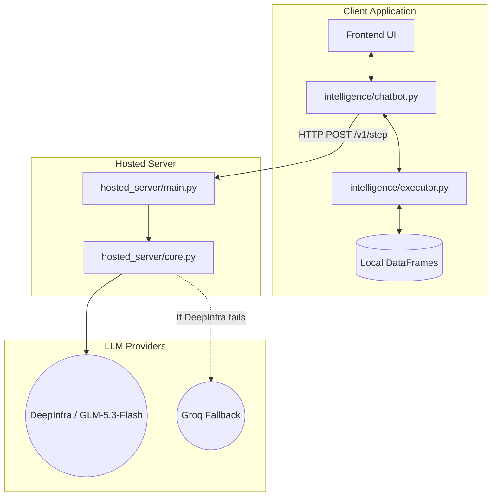
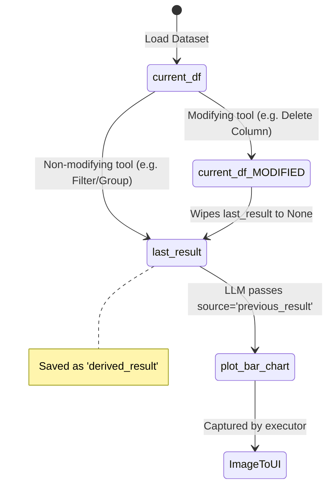

# State Lifecycle and Call Graph

## Diagram 1: High-Level Architecture & Deployment

```mermaid
graph TD
    subgraph Client Application
        UI[Frontend UI]
        Chatbot[intelligence/chatbot.py]
        Executor[intelligence/executor.py]
        Pandas[(Local DataFrames)]
    end
    subgraph Hosted Server
        Main[hosted_server/main.py]
        Core[hosted_server/core.py]
    end
    subgraph LLM Providers
        DeepInfra((DeepInfra / GLM-5.3-Flash))
        Groq((Groq Fallback))
    end

    UI <--> Chatbot
    Chatbot -->|HTTP POST /v1/step| Main
    Main --> Core
    Core --> DeepInfra
    Core -.->|If DeepInfra fails| Groq
    Chatbot <--> Executor
    Executor <--> Pandas
```

## Diagram 2: `current_df` vs `last_result` Flow

```mermaid
stateDiagram-v2
    [*] --> current_df: Load Dataset
    
    current_df --> last_result: Non-modifying tool (e.g. Filter/Group)
    note right of last_result: Saved as 'derived_result'
    
    last_result --> plot_bar_chart: LLM passes source='previous_result'
    plot_bar_chart --> ImageToUI: Captured by executor
    
    current_df --> current_df_MODIFIED: Modifying tool (e.g. Delete Column)
    current_df_MODIFIED --> last_result: Wipes last_result to None
```
